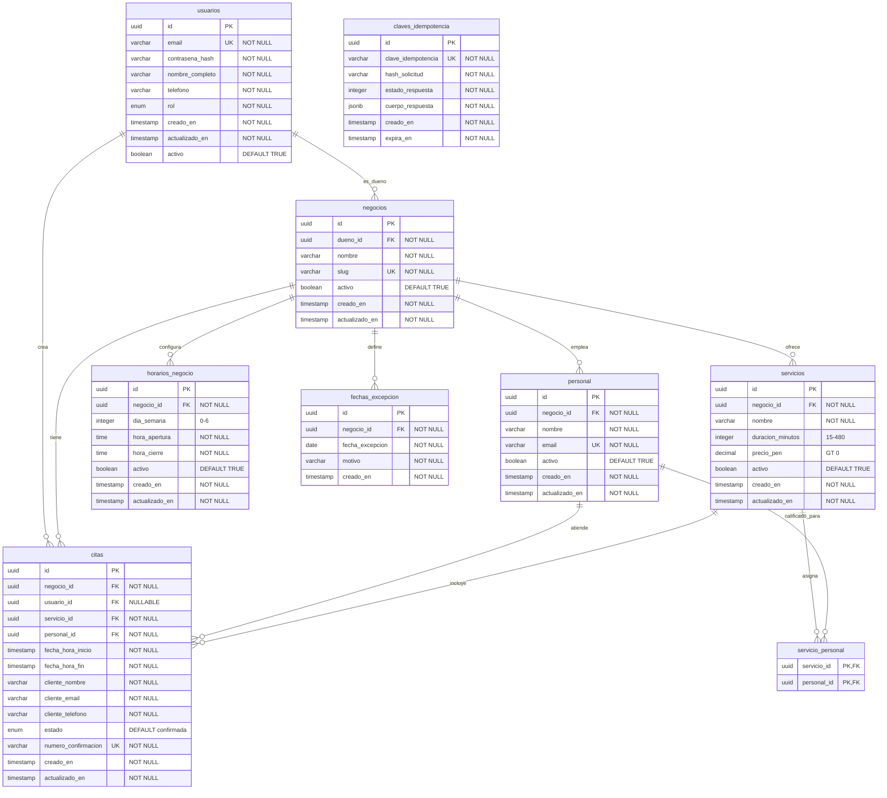

# Modelamiento de Datos - Agenda Salón

## Información del Documento
- **Versión:** 1.0
- **Fecha:** 2026-02-04
- **Sistema de Gestión:** PostgreSQL 15+

---

## 1. Definición de Entidades

### 1.1 usuarios
Almacena información de usuarios del sistema (clientes y dueños de negocio).

**Atributos:**
- `id` (UUID, PK): Identificador único del usuario
- `email` (VARCHAR(255), UNIQUE, NOT NULL): Email del usuario para autenticación
- `contrasena_hash` (VARCHAR(255), NOT NULL): Contraseña hasheada con bcrypt
- `nombre_completo` (VARCHAR(255), NOT NULL): Nombre completo
- `telefono` (VARCHAR(20), NOT NULL): Número de teléfono
- `rol` (ENUM, NOT NULL): Rol del usuario ('cliente', 'dueno_negocio')
- `creado_en` (TIMESTAMP, NOT NULL): Fecha de creación
- `actualizado_en` (TIMESTAMP, NOT NULL): Última actualización
- `activo` (BOOLEAN, NOT NULL, DEFAULT TRUE): Indicador de usuario activo

**Restricciones:**
- Email único para evitar duplicados
- Rol limitado a valores válidos mediante ENUM

---

### 1.2 negocios
Almacena información de los negocios/salones registrados en la plataforma.

**Atributos:**
- `id` (UUID, PK): Identificador único del negocio
- `dueno_id` (UUID, FK, NOT NULL): ID del usuario dueño del negocio
- `nombre` (VARCHAR(100), NOT NULL): Nombre del negocio
- `slug` (VARCHAR(50), UNIQUE, NOT NULL): Identificador URL amigable
- `activo` (BOOLEAN, NOT NULL, DEFAULT TRUE): Indicador de negocio activo
- `creado_en` (TIMESTAMP, NOT NULL): Fecha de creación
- `actualizado_en` (TIMESTAMP, NOT NULL): Última actualización

**Restricciones:**
- Slug único para URLs amigables
- Un usuario puede ser dueño de múltiples negocios (relación 1:N)

---

### 1.3 personal
Almacena información del personal del salón.

**Atributos:**
- `id` (UUID, PK): Identificador único del personal
- `negocio_id` (UUID, FK, NOT NULL): ID del negocio al que pertenece
- `nombre` (VARCHAR(255), NOT NULL): Nombre del personal
- `email` (VARCHAR(255), UNIQUE, NOT NULL): Email del personal
- `activo` (BOOLEAN, NOT NULL, DEFAULT TRUE): Indicador de personal activo
- `creado_en` (TIMESTAMP, NOT NULL): Fecha de creación
- `actualizado_en` (TIMESTAMP, NOT NULL): Última actualización

**Restricciones:**
- Email único para identificación
- Pertenece a un único negocio

---

### 1.4 servicios
Catálogo de servicios ofrecidos por el salón.

**Atributos:**
- `id` (UUID, PK): Identificador único del servicio
- `negocio_id` (UUID, FK, NOT NULL): ID del negocio al que pertenece
- `nombre` (VARCHAR(255), NOT NULL): Nombre del servicio
- `duracion_minutos` (INTEGER, NOT NULL): Duración en minutos (15-480)
- `precio_pen` (DECIMAL(10,2), NOT NULL): Precio en soles peruanos
- `activo` (BOOLEAN, NOT NULL, DEFAULT TRUE): Indicador de servicio activo
- `creado_en` (TIMESTAMP, NOT NULL): Fecha de creación
- `actualizado_en` (TIMESTAMP, NOT NULL): Última actualización

**Restricciones:**
- duracion_minutos entre 15 y 480 minutos
- precio_pen mayor que 0
- Pertenece a un único negocio

---

### 1.5 servicio_personal
Tabla de unión que relaciona servicios con personal calificado (relación N:N).

**Atributos:**
- `servicio_id` (UUID, PK, FK): ID del servicio
- `personal_id` (UUID, PK, FK): ID del personal

**Restricciones:**
- Clave primaria compuesta (servicio_id, personal_id)
- Eliminación en cascada al eliminar servicio o personal

---

### 1.6 citas
Almacena las citas/reservas realizadas.

**Atributos:**
- `id` (UUID, PK): Identificador único de la cita
- `negocio_id` (UUID, FK, NOT NULL): ID del negocio donde se realiza la cita
- `usuario_id` (UUID, FK, NULLABLE): ID del usuario (NULL para invitados)
- `servicio_id` (UUID, FK, NOT NULL): ID del servicio
- `personal_id` (UUID, FK, NOT NULL): ID del personal asignado
- `fecha_hora_inicio` (TIMESTAMP, NOT NULL): Fecha y hora de inicio
- `fecha_hora_fin` (TIMESTAMP, NOT NULL): Fecha y hora de fin
- `cliente_nombre` (VARCHAR(255), NOT NULL): Nombre del cliente
- `cliente_email` (VARCHAR(255), NOT NULL): Email del cliente
- `cliente_telefono` (VARCHAR(20), NOT NULL): Teléfono del cliente
- `estado` (ENUM, NOT NULL, DEFAULT 'confirmada'): Estado de la cita
- `numero_confirmacion` (VARCHAR(20), UNIQUE, NOT NULL): Número de confirmación
- `creado_en` (TIMESTAMP, NOT NULL): Fecha de creación
- `actualizado_en` (TIMESTAMP, NOT NULL): Última actualización

**Restricciones:**
- fecha_hora_fin debe ser mayor que fecha_hora_inicio
- numero_confirmacion único
- Estado limitado a: 'pendiente', 'confirmada', 'pendiente_actualizacion', 'cancelada', 'completada'
- Pertenece a un único negocio

---

### 1.7 horarios_negocio
Define horarios de atención del salón por día de la semana.

**Atributos:**
- `id` (UUID, PK): Identificador único
- `negocio_id` (UUID, FK, NOT NULL): ID del negocio al que pertenece
- `dia_semana` (INTEGER, NOT NULL): Día de la semana (0=Domingo, 6=Sábado)
- `hora_apertura` (TIME, NOT NULL): Hora de apertura
- `hora_cierre` (TIME, NOT NULL): Hora de cierre
- `activo` (BOOLEAN, NOT NULL, DEFAULT TRUE): Indicador de configuración activa
- `creado_en` (TIMESTAMP, NOT NULL): Fecha de creación
- `actualizado_en` (TIMESTAMP, NOT NULL): Última actualización

**Restricciones:**
- dia_semana entre 0 y 6
- hora_apertura debe ser menor que hora_cierre
- Solo un horario activo por día de la semana por negocio
- Pertenece a un único negocio

---

### 1.8 fechas_excepcion
Fechas de excepción cuando el salón no opera (feriados, vacaciones).

**Atributos:**
- `id` (UUID, PK): Identificador único
- `negocio_id` (UUID, FK, NOT NULL): ID del negocio al que pertenece
- `fecha_excepcion` (DATE, NOT NULL): Fecha de excepción
- `motivo` (VARCHAR(255), NOT NULL): Razón del cierre
- `creado_en` (TIMESTAMP, NOT NULL): Fecha de creación

**Restricciones:**
- Combinación (negocio_id, fecha_excepcion) única para prevenir duplicados por negocio
- Pertenece a un único negocio

---

### 1.9 claves_idempotencia
Almacena claves de idempotencia para prevenir procesamiento duplicado de reservas.

**Atributos:**
- `id` (UUID, PK): Identificador único
- `clave_idempotencia` (VARCHAR(255), UNIQUE, NOT NULL): Clave de idempotencia
- `hash_solicitud` (VARCHAR(64), NOT NULL): Hash SHA-256 del cuerpo de solicitud
- `estado_respuesta` (INTEGER, NOT NULL): Código HTTP de respuesta
- `cuerpo_respuesta` (JSONB, NOT NULL): Cuerpo de respuesta original
- `creado_en` (TIMESTAMP, NOT NULL): Fecha de creación
- `expira_en` (TIMESTAMP, NOT NULL): Fecha de expiración (24 horas)

**Restricciones:**
- clave_idempotencia único
- expira_en calculado automáticamente (creado_en + 24 horas)

---

## 2. Diagrama Entidad-Relación



---

## 3. Scripts DDL

### 3.1 Creación de Base de Datos

```sql
-- Crear base de datos
CREATE DATABASE agenda_salon
    ENCODING 'UTF8'
    LC_COLLATE = 'es_PE.UTF-8'
    LC_CTYPE = 'es_PE.UTF-8'
    TEMPLATE template0;

-- Conectar a la base de datos
\c agenda_salon;

-- Habilitar extensión para UUID
CREATE EXTENSION IF NOT EXISTS "pgcrypto";
```

---

### 3.2 Creación de Tipos ENUM

```sql
-- Tipo ENUM para roles de usuario
CREATE TYPE rol_usuario AS ENUM ('cliente', 'dueno_negocio');

-- Tipo ENUM para estados de cita
CREATE TYPE estado_cita AS ENUM (
    'pendiente',
    'confirmada',
    'pendiente_actualizacion',
    'cancelada',
    'completada'
);
```

---

### 3.3 Función para Actualizar actualizado_en

```sql
-- Función para actualizar automáticamente actualizado_en
CREATE OR REPLACE FUNCTION actualizar_fecha_modificacion()
RETURNS TRIGGER AS $$
BEGIN
    NEW.actualizado_en = NOW();
    RETURN NEW;
END;
$$ LANGUAGE plpgsql;
```

---

### 3.4 Creación de Tablas

#### 3.4.1 Tabla usuarios

```sql
CREATE TABLE usuarios (
    id UUID PRIMARY KEY DEFAULT gen_random_uuid(),
    email VARCHAR(255) UNIQUE NOT NULL,
    contrasena_hash VARCHAR(255) NOT NULL,
    nombre_completo VARCHAR(255) NOT NULL,
    telefono VARCHAR(20) NOT NULL,
    rol rol_usuario NOT NULL,
    creado_en TIMESTAMP WITH TIME ZONE NOT NULL DEFAULT NOW(),
    actualizado_en TIMESTAMP WITH TIME ZONE NOT NULL DEFAULT NOW(),
    activo BOOLEAN NOT NULL DEFAULT TRUE
);

-- Índices
CREATE UNIQUE INDEX idx_usuarios_email ON usuarios(email);
CREATE INDEX idx_usuarios_rol ON usuarios(rol) WHERE activo = TRUE;

-- Trigger para actualizado_en
CREATE TRIGGER actualizar_usuarios_fecha
    BEFORE UPDATE ON usuarios
    FOR EACH ROW
    EXECUTE FUNCTION actualizar_fecha_modificacion();
```

---

#### 3.4.2 Tabla negocios

```sql
CREATE TABLE negocios (
    id UUID PRIMARY KEY DEFAULT gen_random_uuid(),
    dueno_id UUID NOT NULL REFERENCES usuarios(id) ON DELETE RESTRICT,
    nombre VARCHAR(100) NOT NULL,
    slug VARCHAR(50) UNIQUE NOT NULL,
    activo BOOLEAN NOT NULL DEFAULT TRUE,
    creado_en TIMESTAMP WITH TIME ZONE NOT NULL DEFAULT NOW(),
    actualizado_en TIMESTAMP WITH TIME ZONE NOT NULL DEFAULT NOW()
);

-- Índices
CREATE UNIQUE INDEX idx_negocios_slug ON negocios(slug);
CREATE INDEX idx_negocios_dueno ON negocios(dueno_id);
CREATE INDEX idx_negocios_activo ON negocios(activo) WHERE activo = TRUE;

-- Trigger para actualizado_en
CREATE TRIGGER actualizar_negocios_fecha
    BEFORE UPDATE ON negocios
    FOR EACH ROW
    EXECUTE FUNCTION actualizar_fecha_modificacion();
```

---

#### 3.4.3 Tabla personal

```sql
CREATE TABLE personal (
    id UUID PRIMARY KEY DEFAULT gen_random_uuid(),
    negocio_id UUID NOT NULL REFERENCES negocios(id) ON DELETE CASCADE,
    nombre VARCHAR(255) NOT NULL,
    email VARCHAR(255) UNIQUE NOT NULL,
    activo BOOLEAN NOT NULL DEFAULT TRUE,
    creado_en TIMESTAMP WITH TIME ZONE NOT NULL DEFAULT NOW(),
    actualizado_en TIMESTAMP WITH TIME ZONE NOT NULL DEFAULT NOW()
);

-- Índices
CREATE UNIQUE INDEX idx_personal_email ON personal(email);
CREATE INDEX idx_personal_negocio ON personal(negocio_id);
CREATE INDEX idx_personal_activo ON personal(negocio_id, activo) WHERE activo = TRUE;

-- Trigger para actualizado_en
CREATE TRIGGER actualizar_personal_fecha
    BEFORE UPDATE ON personal
    FOR EACH ROW
    EXECUTE FUNCTION actualizar_fecha_modificacion();
```

---

#### 3.4.4 Tabla servicios

```sql
CREATE TABLE servicios (
    id UUID PRIMARY KEY DEFAULT gen_random_uuid(),
    negocio_id UUID NOT NULL REFERENCES negocios(id) ON DELETE CASCADE,
    nombre VARCHAR(255) NOT NULL,
    duracion_minutos INTEGER NOT NULL
        CHECK (duracion_minutos >= 15 AND duracion_minutos <= 480),
    precio_pen DECIMAL(10,2) NOT NULL
        CHECK (precio_pen > 0),
    activo BOOLEAN NOT NULL DEFAULT TRUE,
    creado_en TIMESTAMP WITH TIME ZONE NOT NULL DEFAULT NOW(),
    actualizado_en TIMESTAMP WITH TIME ZONE NOT NULL DEFAULT NOW()
);

-- Índices
CREATE INDEX idx_servicios_negocio ON servicios(negocio_id);
CREATE INDEX idx_servicios_activo ON servicios(negocio_id, activo) WHERE activo = TRUE;
CREATE INDEX idx_servicios_nombre ON servicios(negocio_id, nombre) WHERE activo = TRUE;

-- Trigger para actualizado_en
CREATE TRIGGER actualizar_servicios_fecha
    BEFORE UPDATE ON servicios
    FOR EACH ROW
    EXECUTE FUNCTION actualizar_fecha_modificacion();
```

---

#### 3.4.5 Tabla servicio_personal

```sql
CREATE TABLE servicio_personal (
    servicio_id UUID NOT NULL REFERENCES servicios(id) ON DELETE CASCADE,
    personal_id UUID NOT NULL REFERENCES personal(id) ON DELETE CASCADE,
    PRIMARY KEY (servicio_id, personal_id)
);

-- Índices
CREATE INDEX idx_servicio_personal_servicio ON servicio_personal(servicio_id);
CREATE INDEX idx_servicio_personal_personal ON servicio_personal(personal_id);
```

---

#### 3.4.6 Tabla citas

```sql
CREATE TABLE citas (
    id UUID PRIMARY KEY DEFAULT gen_random_uuid(),
    negocio_id UUID NOT NULL REFERENCES negocios(id) ON DELETE CASCADE,
    usuario_id UUID REFERENCES usuarios(id) ON DELETE SET NULL,
    servicio_id UUID NOT NULL REFERENCES servicios(id) ON DELETE RESTRICT,
    personal_id UUID NOT NULL REFERENCES personal(id) ON DELETE RESTRICT,
    fecha_hora_inicio TIMESTAMP WITH TIME ZONE NOT NULL,
    fecha_hora_fin TIMESTAMP WITH TIME ZONE NOT NULL,
    cliente_nombre VARCHAR(255) NOT NULL,
    cliente_email VARCHAR(255) NOT NULL,
    cliente_telefono VARCHAR(20) NOT NULL,
    estado estado_cita NOT NULL DEFAULT 'confirmada',
    numero_confirmacion VARCHAR(20) UNIQUE NOT NULL,
    creado_en TIMESTAMP WITH TIME ZONE NOT NULL DEFAULT NOW(),
    actualizado_en TIMESTAMP WITH TIME ZONE NOT NULL DEFAULT NOW(),
    CONSTRAINT cita_fin_despues_inicio
        CHECK (fecha_hora_fin > fecha_hora_inicio)
);

-- Índice crítico para prevención de doble booking (incluye negocio_id)
CREATE INDEX idx_citas_negocio_personal_fecha ON citas(
    negocio_id,
    personal_id,
    fecha_hora_inicio,
    fecha_hora_fin
) WHERE estado IN ('confirmada', 'pendiente_actualizacion');

-- Índices adicionales
CREATE INDEX idx_citas_negocio ON citas(negocio_id);
CREATE INDEX idx_citas_usuario ON citas(usuario_id)
    WHERE usuario_id IS NOT NULL;
CREATE INDEX idx_citas_fecha_hora ON citas(negocio_id, fecha_hora_inicio);
CREATE INDEX idx_citas_estado ON citas(negocio_id, estado);
CREATE INDEX idx_citas_servicio ON citas(servicio_id);
CREATE UNIQUE INDEX idx_citas_confirmacion ON citas(numero_confirmacion);

-- Trigger para actualizado_en
CREATE TRIGGER actualizar_citas_fecha
    BEFORE UPDATE ON citas
    FOR EACH ROW
    EXECUTE FUNCTION actualizar_fecha_modificacion();
```

---

#### 3.4.7 Tabla horarios_negocio

```sql
CREATE TABLE horarios_negocio (
    id UUID PRIMARY KEY DEFAULT gen_random_uuid(),
    negocio_id UUID NOT NULL REFERENCES negocios(id) ON DELETE CASCADE,
    dia_semana INTEGER NOT NULL
        CHECK (dia_semana >= 0 AND dia_semana <= 6),
    hora_apertura TIME NOT NULL,
    hora_cierre TIME NOT NULL,
    activo BOOLEAN NOT NULL DEFAULT TRUE,
    creado_en TIMESTAMP WITH TIME ZONE NOT NULL DEFAULT NOW(),
    actualizado_en TIMESTAMP WITH TIME ZONE NOT NULL DEFAULT NOW(),
    CONSTRAINT apertura_antes_cierre CHECK (hora_apertura < hora_cierre)
);

-- Índice único condicional (solo un horario activo por día por negocio)
CREATE UNIQUE INDEX idx_horarios_negocio_dia_activo
    ON horarios_negocio(negocio_id, dia_semana)
    WHERE activo = TRUE;

-- Índices de búsqueda
CREATE INDEX idx_horarios_negocio ON horarios_negocio(negocio_id);
CREATE INDEX idx_horarios_dia ON horarios_negocio(negocio_id, dia_semana)
    WHERE activo = TRUE;

-- Trigger para actualizado_en
CREATE TRIGGER actualizar_horarios_fecha
    BEFORE UPDATE ON horarios_negocio
    FOR EACH ROW
    EXECUTE FUNCTION actualizar_fecha_modificacion();
```

---

#### 3.4.8 Tabla fechas_excepcion

```sql
CREATE TABLE fechas_excepcion (
    id UUID PRIMARY KEY DEFAULT gen_random_uuid(),
    negocio_id UUID NOT NULL REFERENCES negocios(id) ON DELETE CASCADE,
    fecha_excepcion DATE NOT NULL,
    motivo VARCHAR(255) NOT NULL,
    creado_en TIMESTAMP WITH TIME ZONE NOT NULL DEFAULT NOW()
);

-- Índice único compuesto (una fecha de excepción por negocio)
CREATE UNIQUE INDEX idx_fechas_excepcion_negocio_fecha
    ON fechas_excepcion(negocio_id, fecha_excepcion);

-- Índice de búsqueda
CREATE INDEX idx_fechas_excepcion_negocio ON fechas_excepcion(negocio_id);
```

---

#### 3.4.9 Tabla claves_idempotencia

```sql
CREATE TABLE claves_idempotencia (
    id UUID PRIMARY KEY DEFAULT gen_random_uuid(),
    clave_idempotencia VARCHAR(255) UNIQUE NOT NULL,
    hash_solicitud VARCHAR(64) NOT NULL,
    estado_respuesta INTEGER NOT NULL,
    cuerpo_respuesta JSONB NOT NULL,
    creado_en TIMESTAMP WITH TIME ZONE NOT NULL DEFAULT NOW(),
    expira_en TIMESTAMP WITH TIME ZONE NOT NULL
        DEFAULT (NOW() + INTERVAL '24 hours')
);

-- Índices
CREATE UNIQUE INDEX idx_clave_idempotencia ON claves_idempotencia(clave_idempotencia);
CREATE INDEX idx_idempotencia_expiracion ON claves_idempotencia(expira_en);
```

---

### 3.5 Datos Iniciales

```sql
-- NOTA: En el modelo Multi-Tenant, los horarios de atención se configuran
-- por cada negocio después de su creación. No se pueden insertar datos
-- iniciales sin un negocio_id válido.

-- Ejemplo de inserción de horarios para un negocio específico:
-- INSERT INTO horarios_negocio (negocio_id, dia_semana, hora_apertura, hora_cierre)
-- SELECT id, dia, '09:00', '19:00'
-- FROM negocios, generate_series(1, 6) AS dia  -- Lunes a Sábado
-- WHERE slug = 'mi-negocio';

-- Los horarios por defecto se crearán automáticamente al crear un negocio
-- a través de la lógica de la aplicación (negocio_service.py)
```

---

**Fin del Documento**
